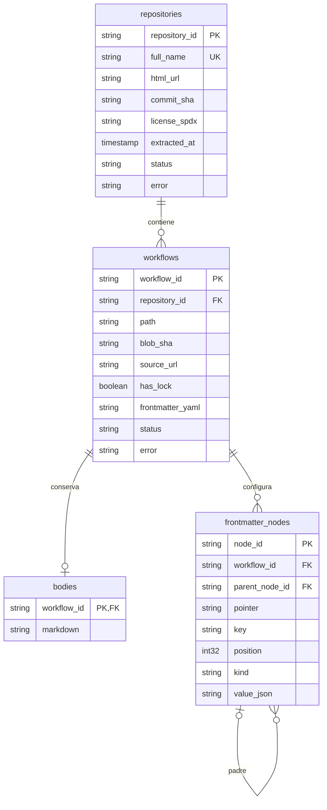

# Esquema entidad-relación

Un repositorio tiene 0..N archivos Markdown; cada archivo pertenece exactamente a
un repositorio. La combinación `(repository_id, path)` es única. Un archivo
descargado tiene exactamente un body, incluso vacío; una descarga fallida no tiene
body. Un archivo con YAML válido tiene 1..N nodos, incluyendo la raíz mapping
(incluso para frontmatter vacío). Los archivos sin YAML válido no tienen nodos.

Cada nodo pertenece exactamente a un archivo y tiene 0..1 padre. Solo la raíz
carece de padre; un padre puede tener 0..N hijos. Padre e hijo siempre pertenecen
al mismo archivo. El árbol conserva claves, orden de listas, contenedores vacíos
y tipos escalares. `(workflow_id, pointer)` es único. Los nodos permiten consultar
campos arbitrarios (`on`, `permissions`, `tools`, `engine`, `safe-outputs`, etc.)
sin modificar el esquema cada vez que GH-AW incorpora una propiedad.

Los IDs SHA-256 son deterministas: repository_id usa `owner/repo` en minúsculas;
workflow_id usa ese nombre, un separador NUL y la ruta POSIX. node_id concatena
workflow_id, `:` y el JSON Pointer. No se mezclan versiones de un archivo dentro
de una extracción: las lecturas usan el commit de la rama predeterminada fijado
al comenzar cada repositorio. Los IDs permanecen entre ejecuciones; un cambio
de nombre/ruta cambia el ID. No son los IDs numéricos internos de GitHub.

Parquet no implementa restricciones SQL de PK/FK. Miner construye las tablas
con esas invariantes y las pruebas verifican unicidad y referencias.

La detección sigue el par `.md`/`.lock.yml` en el mismo directorio. La extracción
conserva **todos** los `.md` bajo `.github/workflows/`, incluidos subdirectorios
y archivos auxiliares; `has_lock` permite seleccionar solo pares compilados.

Referencia de formato: [GitHub Agentic Workflows](https://github.github.com/gh-aw/reference/workflow-structure/).
